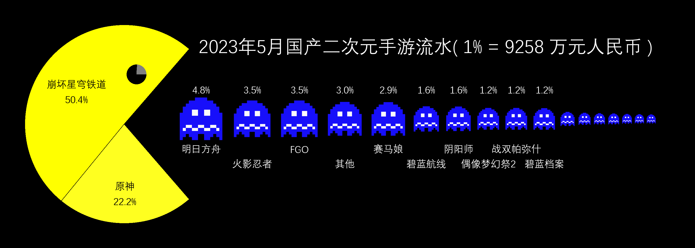

# Pacman Graph

生成吃豆人样式的统计图，用于凸显头部的若干项目

## Usage

安装Python，编辑`data.json`填入数据，然后运行`python pacman_graph.py`即可。
Windows用户也可直接执行`生成pacman图.bat`

## Demo

## TODO

现在仍然需要修改代码使各元素位于正确的位置。
后续版本中会加入自动生成功能。